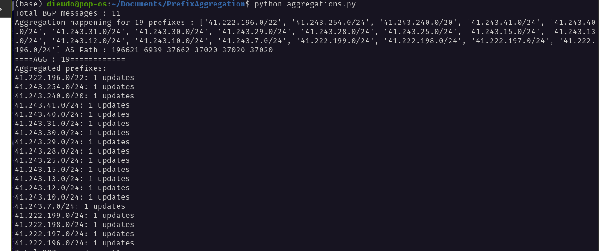
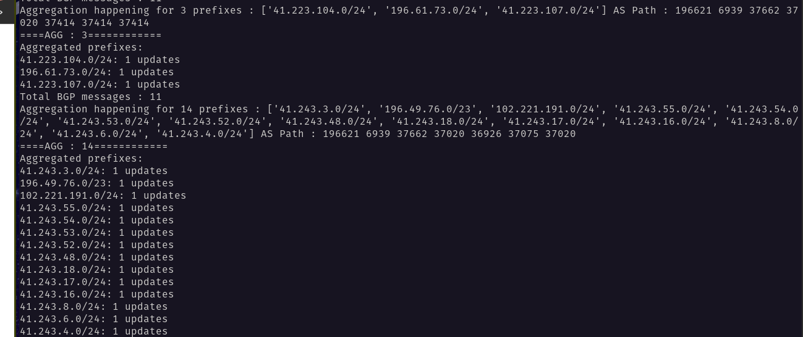

# ASSIGNEMENT ON Prefix Aggregation
Assume you have BGP data.
- How do you find out prefix aggregation that takes place?
- How do you then study the stability of the aggregated routes versus the more specific routes?
- What can this study tell you about traffic engineering?

For the first 2 points, please describe the methodology in a brief readme and provide some preliminary code.

# I. How do you find out prefix aggregation that takes place?
Route Aggregation (RA) also known as BGP Route Summarization is a method to minimize the size of the routing table, announcing the whole address block received from the Regional Internet Registry (RIR) to other ASes. RA is opposite to non-aggregation routing, where individual sub-prefixes of the address block are announced to BGP peers.

RIRs allocate a resource to an operator e.g. let’s say a /20 when you get the updates from RIS, we first check the “super” prefix
e.g. `41.222.196.0/22` is a block assigned to CELTEL (AS37020) . `whois -hwhois.afrinic.net 41.222.196.0/22` . 

`41.222.196.0/22` is announced by AS3720 but, in the routing table we can see "more specific" prefixes : [Celtel (https://stat.ripe.net/ui2013/41.222.196.0%2F22#tabId=routing)] .
In this case ,  the prefixes are “de-aggregated”, because the whole allocated block by the RIR is not announced.

## Why does it matter ?
 - RA reduces the size of the global routing table
  - decreases routers’ workload and saves network bandwidth.
  
  # II. How do you then study the stability of the aggregated routes versus the more specific routes?
  Taking the example above, “41.222.196.0/22” is announced by AS37020, and but also the “more specifics”. To know the stability of the announcements, We would look over a period of time and see the changes in the “more specifics” and compare the number of changes to the /22 block. Usually,  the more specifc routes are more “noisy”, meaning they change often because the operator is doing traffic engineering. BGP always prefer “more specific” prefixes and “shorter as-paths”.
  

# 1. Methodology to find out prefix aggregation that takes place?

In order to identify prefix aggregation, we follow a sequential list of steps described as follows:
## 1.1 : Understand BGP data info (fields & subfields):
BGP (Border Gateway Protocol) is a routing protocol used to exchange routing and reachability information between autonomous systems (ASes) on the Internet. It is responsible for routing traffic between networks and determining the most efficient path for data to take. BGP uses a path vector routing protocol, in which each router sends its entire routing table to its neighbors. BGP routers use this information to build a routing table that describes the best path to each network.

There are several types of BGP messages that are used to exchange routing and reachability information between routers. These include:

- OPEN messages: These are used to establish a BGP connection between two routers.
- KEEPALIVE messages: These are used to maintain a BGP connection between two routers.
- UPDATE messages: These are used to exchange routing and reachability information between routers.
- NOTIFICATION messages: These are used to inform a router of an error or a problem with the BGP connection.
- ROUTE-REFRESH messages: These are used to request a router to send its routing table to another router.
For the sake of this assignement, we filtered `UPDATE messages` 

## 1.2 : Query, Process and Analyze Live BGP data on RIS live :
While there as different tools and packages used to query BGP messages, we adopted RIS (Routing Information Service) Live, a service provided by the RIPE NCC (Network Coordination Centre) to allow us to access real-time BGP data from a global network of route collectors. 
This tool is provides :
- High level of granularity and accuracy : It collects BGP data from a large number of route collectors around the world,and a comprehensive view of global routing dynamics in near real-time : great for network analysis, traffic engineering, and security monitoring tasks

- Data is accessible through WebSocket connection, which allows for real-time streaming of data with low latency. This can be useful for applications that require real-time processing of BGP data, such as detecting routing anomalies or detecting network outages.
RIS Live BGP data is useful for range of tasks and applications that require accurate and up-to-date information about global routing dynamics.

## 1.3 Implement script to identify prefix aggregation and assess stability of Aggregated/Non-aggregated routes:
The `aggregations.py` file is a script that connects to the RIS Live BGP data stream provided by the RIPE NCC (Network Coordination Centre) and processes the data received from the stream. The script first `establishes a WebSocket connection` to the RIS Live stream using the websocket library, and then `subscribes to all BGP updates` by sending a `ris_subscribe message` to the stream.

Once the script is connected to the stream and subscribed to BGP updates, it enters an infinite loop in which it waits for data to be received from the stream. When data is received, it is `parsed and processed` using the json library. The script looks for `two types` of BGP messages in the stream: `announcements and withdrawals`.

If an announcement message is received, the script `checks the number of prefixes` included in the message. If the message includes `multiple prefixes`, the script considers this to be an `aggregated route` and prints a message indicating that aggregation is happening for the given prefixes and AS path. If the message includes `a single prefix`, the script considers this to be an `unaggregated route` and prints a message indicating that no aggregation is happening for the given prefix and AS path. The script also prints the `frequency of updates` for each prefix, which can be used to `assess the stability of the route`.

If a withdrawal message is received, the script prints a message indicating that the prefix included in the message has been withdrawn.

## 1.4 Execute the Script :
- Clone the Repo using the command `git clone https://github.com/monsieurpapa/PrefixAggregation.git`
- Change to its Directory with  `cd PrefixAggregation`
- Execute script with `python aggregations.py`

## 1.5 Terminal view of the output
### Example one

### Example two

# 2. What can this study tell us about Data Engineering ?

The analysis of the stability of aggregated routes versus more specific routes can provide valuable information for traffic engineering. 
By understanding which type of route is more stable and reliable,

-  we can identify whether Large transit providers are splitting their address space intro smaller prefixes to do traffic engineering or segregate Point of Presence .
A previous study in 2017 shows that most of top 30 biggest ASNs do announce deaggregated prefixes : https://labs.ripe.net/author/julien_gamba/bgp-table-fragmentation-what-who/
- On the other hand, if more specific routes are found to be more stable, traffic engineers may choose to use them more often in order to provide more granular control over traffic routing. 

- the analysis of route stability can help traffic engineers to better understand the behavior of BGP routing and make more effective decisions about how to manage traffic on a network.

